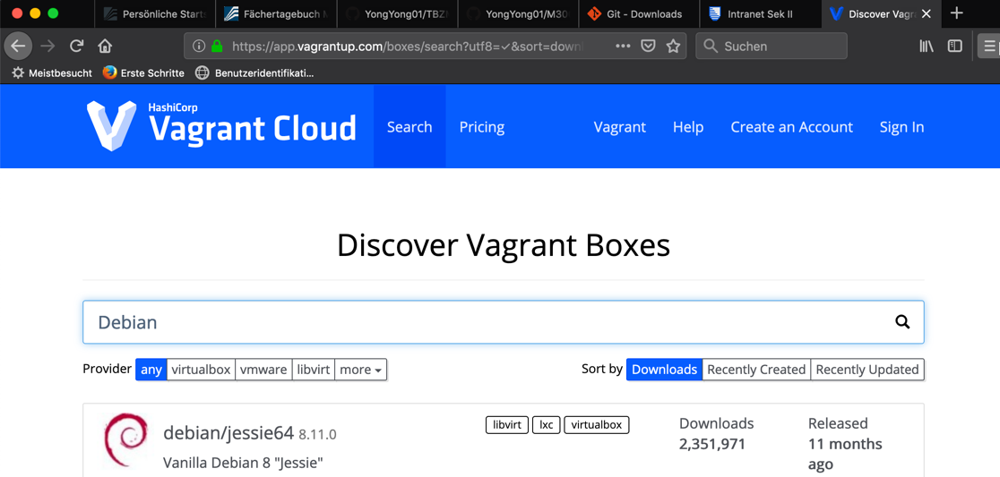

# TBZM300
Dokumentation Modul 300

## Inhaltsverzeichnis

* 01 - [K1](#k1-)
* 02 - [K2](#k2-)
* 03 - [K3](#k3-)
* 04 - [K4](#k4-)
* 05 - [K5](#k5-)

## K1 <a name="k1"></a>
> [⇧ **Nach oben**](#inhaltsverzeichnis)
### VirtualBox
***
Virtual Box ist eine Virtualisierungssoftware von Oracle. Wir benutzen dieses Programm, um mit Vagrant VMs zu erstellen.

 Oracle VM VirtualBox ist ziemlich einfach, aber auch sehr leistungsfähig. Es kann überall laufen, von kleinen Embedded-Systemen oder Desktop-Computern bis hin zu Rechenzentrumsbereitstellungen und sogar Cloud-Umgebungen. 

Auf jeder einzelnen virtuellen Maschine kann 

Auf folgender Seite kann VirtualBox installiert werden: https://www.virtualbox.org/wiki/Downloads

#### Installation
***
1. In den Sicherheitseinstellungen vom Mac muss der Zugriff für VirtualBox erlaubt werden


2. Danach geht man normal die Installation durch und wählt den Pfad aus, wo VirtualBox installiert werden soll


### Vagrant
***
Vagrant ist ein Tool zum Erstellen und Verwalten von Umgebungen virtueller Maschinen in einem einzigen Workflow.

Vagrant bietet einfach zu konfigurierende Arbeitsumgebungen, die auf  einem einzigen Workflow gesteuert werden, um die Produktivität und Flexibilität eines wiederholendes Vorgehen zu automatisieren.

Auf folgender Seite kann Vagrant installiert werden: https://www.vagrantup.com/downloads.html

#### Installation
***
1. Die Installationsdatei muss ausgewählt und ausgeführt werden.
2. Danach kann man die normale Installation durchführen und wählt den Pfad aus, wo Vagrant installiert werden soll


### Visualstudio-Code
***
Visualstudio Code ist ein Editor für verschiedene Programmiersprachen. Es können Externsions installiert werden, um weitere Sprachen darin zu programmieren.

Mit dem Editor kann man eine beliebige Anzahl von Erweiterungen von Drittanbietern installieren. Während die meisten Szenarien "out of the box" ohne Konfiguration funktionieren, ist es möglich die Programme auf seine eigene individuellen Erlebnisse anzupassen. VS Code ist ein Open-Source-Projekt, so dass man auch vieles auf Github mit beitragen kann.

Auf der folgender Seite kann Visualstudio Code installiert werden: https://code.visualstudio.com/

### SSH-Key für Client erstellt
***
Mittels eines SSH-Keys ist es möglich auf einem Server zuzugreifen. Heute wird das SSH-Protokoll häufig verwendet, um sich von einem System in ein anderes einzuloggen, und seine starke Verschlüsselung macht es ideal, um Aufgaben wie die Ausgabe von Remote-Befehlen und die Remote-Verwaltung der Netzwerkinfrastruktur und anderer wichtiger Systemkomponenten auszuführen. Um das SSH-Protokoll verwenden zu können, müssen einige Softwarekomponenten installiert werden. Dazu führt man folgende Schritte aus.

1. Terminal (Bash) öffnen
2. Folgenden Befehl mit der Account-E-Mail von GitHub einfügen: 
    ```
        ssh-keygen -t rsa -b 4096 -C "beispiel@beispiel.com"
    ```
3. Neuer SSH-Key wird erstellt: 
    ```
        Generating public/private rsa key pair.
    ```
4. Bei der Abfrage, unter welchem Namen der Schlüssel gespeichert werden soll, die Enter-Taste drücken (für Standard): 
    ```
        Enter a file in which to save the key (~/.ssh/id_rsa): [Press enter]
    ```
5. Nun kann ein Passwort für den Key festgelegt werden. Ich empfehle dieses zu setzen und anschliessend dem SSH-Agent zu hinterlegen, sodass keine erneute Eingabe (z.B. beim Pushen) notwendig ist: 
    ```
        Enter passphrase (empty for no passphrase): [Passwort]
        Enter same passphrase again: [Passwort wiederholen]
    ```

Der SSH Key kann im GitHub hinterlegt werden, um Repositorys lokal über eine SSH Verbindung zu klonen

## K2 <a name="k2"></a>
> [⇧ **Nach oben**](#inhaltsverzeichnis)

### GitHub oder Gitlab-Account erstellt
***
Die Leistung von Git sind im Vergleich zu vielen Alternativen sehr stark. Das Einbringen neuer Änderungen, das Branchen, Merging und Vergleichen vergangener Versionen sind leistungsoptimiert.

Um einen GitHub Account zu erstellen, öffnet man die Seite https://github.com/join?source=header-home und folgt dort die einzelnen Steps
1. Username auswählen
2. Eine gültige E-Mailadresse eingeben
3. Passwort eingeben
4. Verifizieren, dass man kein Roboter ist


### Git-Client wurde verwendet
***
Der Git-Installer kann unter folgender Seite installiert werden: https://git-scm.com/downloads

**Commands**

| Commands | Bedeutung |
| -------------- | -------------- |
| git branch | Mit diesem Befehl listet man alle Branches im eigenem Repo auf. Ebenfalls ist es möglich eigene Branches zu erstellen oder zu dem genannten Branch zu wechseln |
| git checkout | Mit diesem Befehl wechselt man einen Branch |
| git commit | Damit ruft man eine Bestätigung für eine gespeicherte Aktion aus |
| git clone | Mit diesem Befehl klont man lokal ein Repository aus einem Git |
| git add | Mit diesem Befehl kann man eine Datei zum Upload hinzufügen |
| git push | Mit Git Push wird ein Upload bzw. ein Push durchgeführt | 

### Markdown-Editor ausgewählt und eingerichtet
Das Markdown ist eine zusätzliche Extension, um Git Dokumentationen zu schreiben.
Die Extension kann im VisualStudio Codes installiert werden.

Mardown All in One von Yu Zhang


### Dokumentation ist als Markdown vorhanden
***
Die Dokumentation wurde im VisualStudio Code mit der Extension Markdown All In One geschrieben.


## K3 <a name="k3"></a>
> [⇧ **Nach oben**](#inhaltsverzeichnis)

### Bestehende vm aus Vagrant-Cloud einrichten
1. Um die bestehende Vagrant VM zu starten muss man zuerst den Repo vom Modul klonen
    ```
        git clone https://github.com/YongYong01/M300-1.git
    ```
2. Danach exploriert man in das Verzeichnis der VM
    ```
        cd M300/vagrant/web
    ```
3. Die Vagrant VM startet man mit folgendem Befehl
    ```
        vagrant up
    ```
4. Man kann auf die VM per SSH zugreifen
   ```
        vagrant ssh
   ```

### Andere, vorgefertigte vm auf eigenem Notebook aufgesetzt
***
Man kann von der Seite https://app.vagrantup.com/boxes/search?utf8=%E2%9C%93&sort=downloads&provider=&q= verschiedene VM Boxen herunterladen, um einzelne Vagrantmaschinen zu installieren und einzurichten.

1. Nun kann man im Terminal folgenden Befehl eingeben, um die Debian Box zu installieren
    ```
        vagrant box add debian/jessie64

        Result:
        ==> box: Loading metadata for box 'debian/jessie64'
        box: URL: https://vagrantcloud.com/debian/jessie64
        This box can work with multiple providers! The providers that it
        can work with are listed below. Please review the list and choose
        the provider you will be working with.

        1) libvirt
        2) virtualbox

        Enter your choice: 2
    ```
2. Danach erstellt man ein eigenes Vagrantfile um die VM einzurichten
    ```
        vagrant init debian/jessie64
    ```
3. Zum Schluss kann man auch eigene Konfigurationen mitgeben
    ```
        vi Vagrantfile

        Vagrant.configure("2") do |config|
            config.vm.box = "debian/jessie64"
        end
    ```

### Kennt die Vagrant-Befehle
***

**Commands** 

| Commands | Bedeutung |
| ----- | ----- |
| vagrant box add | fügt vagrant boxen hinzu |
| vagrant box list | listet alle verfügbaren vagrant boxen auf |
| vagrant init | erstellt ein eigenes Vagrantfile |
| vagrant up | erstellt mit dem Vagrantfile die VM | 
| vagrant ssh | man greift mit diesem Befehl auf die Vagrant VM zu (mittels SSH) |
| vagrant halt | stoppt die Vagrant VM |
| vagrant destroy | stoppt und zerstört die Vagrant VM |

### Netzwerkplan
    +-----------------------------------------------------------------------------------------------+
    | Netzwerk: 10.0.2.0/24                                                                         |
    |+---------------------------------------------------------------------------------------------+|
    || Hostname: ch-web01                                                                          ||
    || OS: Ubunt  16.04 LTS                                                                        ||
    ||                                                                                             ||
    || LAN enp3s0: 10.0.2.15                                                                       ||
    || Docker docker0: 172.17.0.1                                                                  ||
    || Port: 80, 443, 8080, 8082                                                                   ||
    || NAT: 32760-32780, 80, 8080, 8081, 8082, 3306,                                               ||
    ||                                                                                             ||
    ||+-----------------------------------------+      +-----------------------------------------+ ||
    |||Jenkins Container                        |      | Apache Container                        | ||
    |||Ports: 8080, 8082                        |      | Ports: 80, 443, 8081                    | ||
    |||Version: 2.60.3                          |      | Version: 14.04                          | ||
    |||Plugins: git-client, docker-engine       |      | Plugins: -                              | ||
    |||                                         |      |                                         | ||
    |||                                         |      |                                         | ||
    ||+-----------------------------------------+      +-----------------------------------------+ ||
    |+---------------------------------------------------------------------------------------------+|
    +-----------------------------------------------------------------------------------------------+

## K4 <a name="k4"></a>
> [⇧ **Nach oben**](#inhaltsverzeichnis)

### Firewall eingerichtet inkl. Rules
***

*Firewall*

Eine Firewall ist eine Netzwerksicherheitsvorrichtung, die den ein- und ausgehenden Netzwerkverkehr überwacht und entscheidet, ob ein bestimmter Datenverkehr basierend auf einem definierten Satz von Sicherheitsregeln zugelassen oder blockiert werden soll.

*ufw*

Das Standard-Firewall-Konfigurationstool für Ubuntu ist ufw. ufw wurde entwickelt, um die Konfiguration von iptables Firewalls zu erleichtern und bietet eine benutzerfreundliche Möglichkeit, eine IPv4- oder IPv6-Host-basierte Firewall zu erstellen. Standardmäßig ist UFW deaktiviert. UFW steht für Uncomplicatet Firewall, da sie sehr schlicht zu verwalten ist.

**Commands**

| Commands | Bedeutung |
| ----- | ----- |
| ufw status | zeigt den Status der Firewall an |
| ufw enable | Aktiviert die Firewall |
| ufw disable | Deaktiviert die Firewall |
| ufw allow | Öffnet einen Port | 
| ufw deny | Blockiert einen Port |
| ufw reject | Blockiert einen Port von ausser (Absender) |

### Reverse-Proxy eingerichtet
***
### Benutzer- und Rechtevergabe ist eingerichtet
***
### Zugang mit SSH-Tunnel abgesichert
***
### Sicherheitsmassnahmen sind dokumentiert
***

## K5 <a name="k5"></a>
> [⇧ **Nach oben**](#inhaltsverzeichnis)
### Kreativität
***
### Komplexität
***
### Umfang
***
### Umsetzung eigener Ideen
***
### Cloud-Integration
***
### Authentifizierung und Autorisierung via LDAP
***
### Übungsdokumentation als Vorlage für Modul-Unterlagen erstellt
*** 
### Persönlicher Lernentwicklung
***
### Vergleich Vorwissen - Wissenszuwachs
***
### Reflexion
***